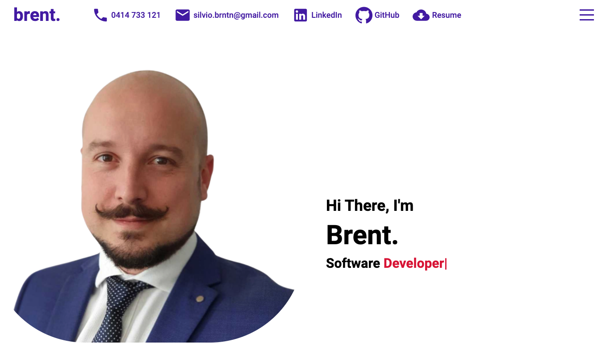
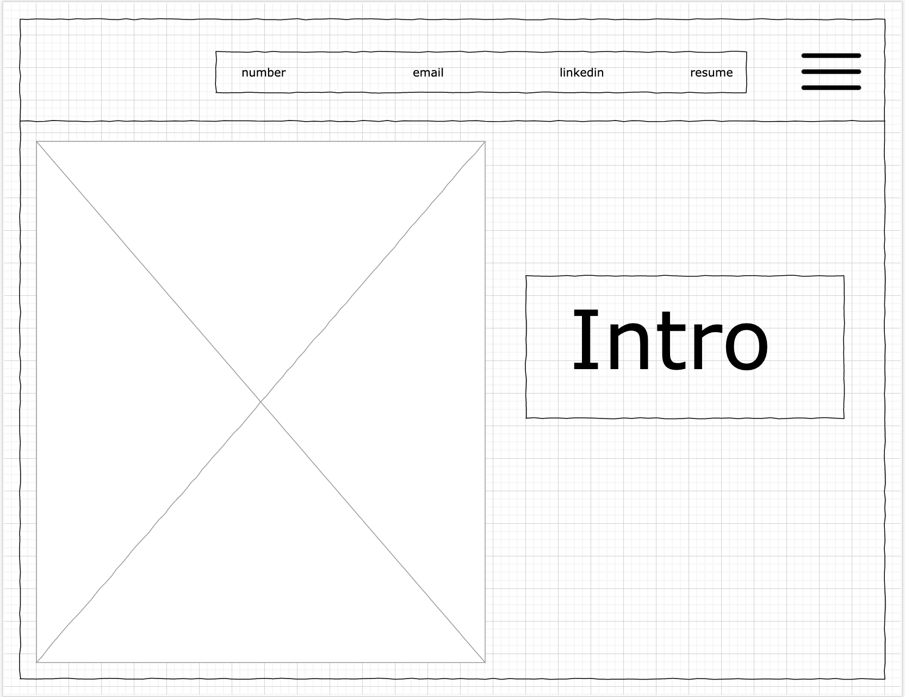

# 📋 ABOUT

This is my own personal portfolio website, I wanted to have a very clean and simple interface to showcase my projects since the beginning of my careeer and works as well as references and contact details.

I've designed it with scalability in mind so that will be easy to update in the future as new projects will be added 

# 👀 SEE IT LIVE
Link to portfolio website: https://brentportfolio.surge.sh

Screenshot of the "homepage"

# ⚙️ TECH USED

- React
- HTML
- Sass (version 4.14.1 as latest version was not compatible with React at the time)
- Ityped
- Material-ui icons
- Axios
- Google forms

# 👨‍💻 USERS

User will be my potential future employers, it will be my own digital introduction to present myself

# ✏️ PLANNING

I've used draw.io to sketch my website
Here is a screenshot of first page of wireframe or Full wireframe link [here](https://viewer.diagrams.net/?tags={}&highlight=0000ff&edit=_blank&layers=1&nav=1&title=Project%204%20wireframe.drawio#R%3Cmxfile%20pages%3D%226%22%3E%3Cdiagram%20name%3D%22Page-1%22%20id%3D%2203018318-947c-dd8e-b7a3-06fadd420f32%22%3E3Vhdk5owFP01PurwIQiPq66723anO7vt9rETIELWkFAIiv31vcGgIDg6XW135AXuveEmOefkJtAzJ3Fxl6IkeuQBpj1DC4qeOe0Zhm5oDtykZ73xOKa1cYQpCVSjneOF%2FMbKqSlvTgKcNRoKzqkgSdPpc8awLxo%2BlKZ81Ww257TZa4JC3HK8%2BIi2vT9IICLl1TVtF7jHJIxU146lAh7yF2HKc6b6Y5zhTSRGVRrVNItQwFc1l3nbMycp52LzFBcTTCWsFWKb92YHotshp5iJU16wRyNv5Dnu0LV0S3etvsqwRDRXMKiBinWFyyoiAr8kyJf2CrjvmeNIxBQsHR7LiWOZXwNrO0FpUORhOt6iM%2BGUpxAq8YGmIuULXDl7hqmV1zZSkSA7mRNK916fcyZmKCZUyu0VpwFiSLmVtnRD2V19IEpCBj4fkMMQHPs8Jr7qrg1rhRNOBS5qLgXzHeYxFukamqhoxfi6aa5qytJs5YzqqqqWA1JyDrepd7zCg6L2RJrd4zRTUmOljv05uP47%2FoYfhz99eCqBF%2BGvSvr%2F1ul5VuPFWbObtNlt1myrgzTrIqRZHaTZFLocB2TZIM%2F%2BlcstYAzTFH0F0g20eMszQebrXQN4CtW9TCQB7swkA%2F2shF4mgl0sKdppHhiQCwaKpVqYlyW13DDhTfpml%2BAuh195r0GGUmEEjgI3KiC4HHYGsyAslG9p59eqPWxq1azOSzWxmm5XhRlZl1CrfbzEVDB9kUw98YwIwiVcHheCx%2Ft8BiiLtky3IK9p4gD6LcIheyJHEhehPIIOYu4v8mRQGsTPBhmJE4offDmm9vHCLa%2BWBI9sXO%2Fbpc4smT3F6KN2ebO6yttWau9RzAPnnzwvCO7XIp88OeRzYT%2Bfcn6sWCNxeQA%2FTvxRlR2gDICflxc0KTu7yZLNh0IpwMqYk0KSP1bjmUZCyC%2BMGwmEMfMDpg0ISGhOQCTpABiUBQ8JBDfpzyRO3CMU9z2UEb%2B%2F5FTCMDMllOM8DXH68xGzvK8bziCB8vF%2B3t1Rk%2FiOw0hXoXDPwDp%2BNb5GXugUaPn89Ea0%2FvcAdbDO8tiDZb3PvdzPmpQnnDBRjsca96xprTJQPBfHSvE3aUz7wwNLsLVSz3CicJvQj9pFuusUaFwKeqMFPY4RoVeIvKV9LOTNFvLwybTAAWFXCL7tfCzwhy3wU5zlMb5C6J3hv4IezN2vpzJW%2B7Vn3v4B%3C%2Fdiagram%3E%3Cdiagram%20name%3D%22Page-2%22%20id%3D%22TbQXLRvN1OdXjOHeYSwx%22%3E7ZpbU%2BIwFMc%2FTR9heqEtfRQQ1xldndXR2aed0IY2miY1TQX2029SUqAXBl25yEBf7DkJSXt%2B%2F3OSgJrVj6dXDCTRLQ0g1kw9mGrWQDNNw9S74o%2F0zOaermXPHSFDgeq0dDygv1A5deXNUADTUkdOKeYoKTt9Sgj0eckHGKOTcrcxxeVZExDCmuPBB7jufUYBj5TX0PVlww%2BIwkhN3bVVwwj4ryGjGVHzEUrgvCUGxTCqaxqBgE5WXNalZvUZpXx%2BF0%2F7EMuwFhG71r0hu2nNBt6TEz6DN%2F3Fd1rzwYaf%2Bcji5RgkfLtDm%2FOh3wHOVCTVu%2FJZEdpJhDh8SIAv7YmQj2b1Ih5jYRniNo8dlHPowlrESBoYjCDuLQLcp5gy0ZSHWHTljL7CwqmZlp5fi5aCo5xkjDCufHxMCR%2BCGGGp2CfIAkCAcit5Gqaym%2BYAGIVE%2BHwRUigaez6Nka%2Bm%2B2C8FZd3yDicruhQxf8K0hhyNhNdVGuhpFnZnKwoVneUM1pVa5FmQKVJuBh6CVzcKOaf4G8dmv92KB%2BEZqeKs4Gn2YhzVzQ7m2litCb420D6fwA73zxNjc5H83RnaWqf0%2FQLNMs4nTpN12iAae8KpmFspilfD4ntzY1kc09TxBGVkRtRzmlcJRiANFqwrQV5RQXFsBeqD6dJI2IxeiKfJJ6Gcr%2FYjqn%2FmiXt3EB%2B2k5RnGB47ctnqi%2FkXn7VRLehdnytUOxDSa5TVpLdbSj4TVIynJ1pqV7y7%2B9%2BPQ7vbq7vNNPB4gF6IybuQr4IzIrMxIvzskISigjPn9LuafZgRU8Yjvl6CYnCg0j4KI1Bq7MGXI3vjkDZRmVlthsqeBMoc2f7LGdzzhdJh%2BL8sLM5bzcWiTUZJ%2FJmnF%2BiSz7ZRZrMD2V5%2FSiMMZrK3O2p5xlEnMvT3IWMhDn0A6K3kagAYyRynLVFAgpvALigOpT%2BVAaKjhCGrRFIkd96p1iiHFoylr2MhZD9uYUkaxlmt52QcFdq8NyyGhqWc69BC97OtOCe6%2F9R1v9Ox67Uf%2BvQ9d%2FqnrV0lFoyrOpe4vBa8s5aOkotVfelVsMRZ89aKtbYs5aOTEvVNc5yD6%2Bl83n5OLVUXeP2q6UXx316tC9%2FjuxEN127%2Fxb8%2FtuqlyWSxSOB%2FUROxovDj0Li2jUiTV9sbuNc3MijntowBgifCo6O%2Fb1wmDUcGJFXGCByKkQc63sRqf9Ax2CaxfBUeLjevngIc%2Flbft628r8S1uU%2F%3C%2Fdiagram%3E%3Cdiagram%20name%3D%22Page-3%22%20id%3D%22LzEZWErQQUimFmHL3UDz%22%3E5Zhdc6IwFIZ%2FDZcyQFT0sn613dlud7dfs3vTiRAgNRAaQtH99ZtgUBBc7VbbzsiNnJOQhPO8OTmigWE4P2cwDq6oi4hmGe5cAyPNskzL6Ikf6VksPT3QWTp8hl3Vae24wX%2BQchrKm2IXJZWOnFLCcVx1OjSKkMMrPsgYzardPEqqs8bQRzXHjQNJ3fuAXR4or2kY64YLhP1ATd3rqIYpdGY%2Bo2mk5otohJYtISyGUV2TALo0K7nAWANDRilf3oXzISIyrEXExrP2j6F%2Fn4Lg%2Bucse7BvLhhvLQebvOaR1csxFPHDDm0th36BJFWRVO%2FKF0VoswBzdBNDR9qZkI8GBgEPibBMcZvHDsk5DGGtYiQNAqeIDFYBHlJCmWjKQyy6ckZnqHBqFjDya9VScJSTeJiQjcc9GvEJDDGRir1HzIURVG4lT9NSdtMckGA%2FEj5HhBSJxoFDQ%2Byo6faMt%2BLyghhH85IOVfzPEQ0RZwvRRbUWSlpUzaykWKOrnEFZrcU2g2qb%2BKuh18DFjWL%2BCv7t3fwJLuEqQzmECP4PbPuTgzXb%2B5I9GtjOR2%2Fsw2zfD6JZxdmt07TNBpidY8EsJvsXTfl6WByIXyWb7zTBHFMZuSnlnIabBF2YBCu2tSCXVFAMe6b6cBo3Ihajx3Il4dyXFYYeUmeWxnpuYCfRExzGBF06ck311N%2FPr5roduSOtyWK91CSaVeVBBpSvg0apASOlhjMPVJ%2BAROHedm1Ww87xbeFpODh5Zfokk92lsTL8jDXZWF4eC41MVDrGQWcy7ryTEbCmjhuZOhYKMvDQjtMF2CF14Ucih%2FpT2Sg6BQT1JrCBDutF0okywmQsRykzEfs8QpFacu0enoc%2BceSQ39DDg3HRL9BDP0DaAH2Hm%2F958kl%2BG2b10%2Ff7hbmr6y1R1ppQP8WyFvSydbUVE00VkOiwTSx9RAnjk6Qx5vryp7hGUfc5d1NqnWsoNtU1R0Jq3laWF3MRJpYLjpDCT8i6f4Hoh7fOc%2FPtxcDa0R%2F9L48Zch2rIYdHKXhVBzim8DFC%2FJqJo8pjni%2Bns5A64xKdYCK%2BBaoomDEkX8rjVGrOGA3D9zauXysUq1dBWJ3ajyaym7rEKdrE4%2F61kMhxORUcLQ7nwtH%2FfOG%2BDc7Qy6OToVIF3wuIqBGhKEkDdGp8LD778VDmOtvk3lb6dsvGP8F%3C%2Fdiagram%3E%3Cdiagram%20name%3D%22Page-4%22%20id%3D%22vDuWvNrTjKXX0ONzP-sh%22%3E7VrbkuI2EP0aqpIHKF8wl0dgYJPKTLKpmewk%2B7IlbNko6OKV5QHy9ZFsGbCtKdhZYNjCvGB1tyW5TzenW6blTsj6Awfx4oEFELccK1i33LuW49iONZBfSrLJJQPXywURR4E22gke0X9QCy0tTVEAk5KhYAwLFJeFPqMU%2BqIkA5yzVdksZLi8agwiWBM8%2BgDXpc8oEAsttS1rp%2FgFomihlx54WjEH%2FjLiLKV6PcoozDUEFNNo02QBArbaE7nTljvhjIn8iqwnECu3Fh77%2B%2Bm5%2F%2Fmx533888vXAR1uoBUM2%2Flks2%2B5ZftwHFJx2qmdfOoXgFPtSf2sYlO4drVAAj7GwFfjlQyfljteCILlyJaXme%2BgWsOSo62P1ACDOcTjrYMnDDMuVZmLpangbAkLYctxreyz1RQ4qkVChHHl9pBRMQMEYRWxnyAPAAVarMPTdvTYtAbAKKJS5kuXQqkc%2B4wgXy93pL81Li%2BQC7jei0Pt%2Fw%2BQESj4RppobRFJm%2FJwtRexVk8LF%2FvRWqQZ0GkSbafeAS4vNObfgL%2F73vifBuV3QbNrV%2BDs1fF0jHCeC83uYTQxesX5p4D0bQB2rzxN7e6xeXq2NPWaNP0ONMtwGrK0bxvA9M4Fpm03aL4ZzWEZzK4pN%2FsGNF3nbHDWaygBE4EIowiou9X0jsVhCKUzfFklV8GWjy7K%2BMYMUZFt1Bu3vLs9Z2MYKlvlMCTL35EWC6YiJJEBg2j0pAZ37e4rv7M1aM%2FFj16FH4cGrAYGrM4Hlanc6WGRu46WUOl9TVVhn3msHWqXjTI4e4DEWYi7rvIpi2F2K6BJTZfZT0x3AZ5Fx2v2arZ2AjkKlShTqDBp6zhQG%2Fk3lVEWbrb6XSvT9vOEVlY8mv%2FkeN524sr1z7snlVeR%2FtaSe8YhUU6Nk5QUnprzPcN893SeqK8gW1XuHYn8iSv2QKK49UZFJxvDRDaGUKTcfG%2BAYpSo6K6uWtjKiMhBLDZ3G1lmuxV6c%2BtZNjQk2fBsSXZEFSoZK1aXiGR9%2FT4oZp8X0nvFbh%2BZjDDElHbOhGDkddqTeRVmH2mSLTZK4vz8Iasui0GI1opNx3o%2Fdwsh1MHFKPvpnvkBtTpIRmiIJOvyjuQ5KQ2AkKDOlDxRjmJzhGF7DhLkt18YVkjOXOXLccojyL88QJpKshh0YhXDZ2LHfoUe3zsW%2Bodj4SC0pfImAMliW%2FjUKpCDcVSvf4pQJOtIHY11CPOXadzJBshPOgkiMYa%2F%2BmpP9TOLYfapVWQH2qTv64kuUWbZtlcKJM82cLdjCKVT9LYP0%2Fvfx8%2BO%2B89gspjOn6eTZPRZH241RfObKrFeGc3LVs1GOE09UFOJNZXYD1yJeVY5yy5ZiRlz7IjD%2FYZ8r5B8u5VDjvcn3%2BY1wdvR7A8qNbnhZ%2BHC5Gvq0Brybcj3BybfQeWlTc%2FwcvWi5HvEK5uGfK%2BQfAeVKs6zLki%2BhALyaRJaS0D%2BkLQ%2F%2B%2BvJ%2Bs3Q%2BdKUzCXqN5LaTreMSN%2BrAWJ6GXsK9jTiUW9dIQEI3wocXe%2B64Kh3ORjRJQwQvRVEeu51IVLvFjiUlRO8FTz6w0vhIYe7%2Fx9mur3%2Fd7rT%2FwE%3D%3C%2Fdiagram%3E%3Cdiagram%20name%3D%22Page-5%22%20id%3D%22wyANPzHblhKcxBpfTew7%22%3E5Zldc5s4FIZ%2FjS%2Fx8A2%2BjO267bbZ3Uw63Zne7Mgggzb6YEHEzv76lUDYgOQ6bUOatuQi6EhG%2BH1ecY7wzFuRw%2BsSFPk1SyGeuXZ6mHnrmes6rh2LfzLy0EZiL2gDWYlSNegUuEX%2FQRW0VbRGKawGAzljmKNiGEwYpTDhgxgoS7YfDtsxPJy1ABnUArcJwHr0L5TyXEUd2z51vIEoy9XUcaA6tiC5y0pWUzUfZRS2PQR0l1FDqxykbN8Lea9m3qpkjLdn5LCCWMraKfaPU23DlbWhtn9TJvfp2rHeWu3FNl%2FykeOXKyHlT3tpt730PcC1UlJ9V%2F7QSbvPEYe3BUhkey%2FsM%2FOWOSdYtBxx2mgH5Ry2aB01kg0MthAvjwKvGGal6GokFkN5ye5gF5y5nt0cx56Oo5xkhzAefXzHKN8AgrB07EdYpoACFVb2dFzVNs0BMMqoiCVCUig6lwkjKFHTPVJvxeUelhweej5U%2Br%2BGjEBePoghqrdz0sOwue851g5VMO%2B7tVtmQC2T7HjpE3Bxoph%2FAX%2FvMn%2BMerj6UJ7CBF8H1n%2FhYB3%2FsWQnA%2Bt%2F74X9NMv3O9Ec4gx1mpFjgBlMBTPQYNKabIUeY6TiC%2FIhxYIhypv7CZazYN2TFMOdHCtlQSKRXqkwZ9IHlbAFotkH2Vhb%2Fpn1pwGcCshofUWBBsS0uNypeIQaD0gAwr8KDt97WTgiDYfIWXcwRfRXIRI6L4vI4nL26WR9L3PJn6xCHDEp75Zxzsg446Sgyo%2B5SEsKPZxnaGkpSVy9kHdCDpncEc0JS%2B7qYt40UFLNK0QKDN8m8p70UnXRHFqSvFDrfFth8xyZLxjVMQs98%2FmRwUjhZE7qjP05K3UsEWl2iZftcNF7Z0AKHLvmEEOaya6qot3NNrbsGjt0kJZYqvtZ55zLbfCVVMLdJCm150gYa4eEdcq54CqiKeDi6bCR8UoKxbYIQ2sLKpRY9wxLlBtParmsywyWf19DWluOG88Lmk3lhkU0tIOhql0YzLCYzAumojbEXC2agSnCf2vWdVhVs7yE%2FrbvFYdTpzjLeLO0KAcJb148lKS7prjH9rLtoEfkkuFz4vwWR3uAjW1KUJrKaZamGn34zJkspYySvBvr9D0Tfn8y%2FHoZrDEZanNhhzOZdPFQOs%2BwgfBMGwhvMun0ivXHkM43vCN5ZuniH1U6Q%2FI2SudEk2mn14G3kKaf0W%2F0Xul8DWgSuV9J2aMnr0jdYXOYHr9afeev5Z9ejB2z%2F1QQo9gdQIyM7wiDeWDAGM7j%2BNtBrq5%2Fs%2Fer37d%2FvANvanLzKfl0Ay29CCthVRP4iJz4U%2Byvoui59leiefpFoenr%2FWLjvfof%3C%2Fdiagram%3E%3Cdiagram%20name%3D%22Page-6%22%20id%3D%22rJmp1nmes9KpraCwUT0O%22%3E7Zlvc6I8EMA%2FjS%2Ft8EeQvlSE1me82lHbm%2BdlhIiZBsJBrPY%2B%2FW0gIAidu%2Fa09sb6Qshu2MD%2BNskudHQ73N0kKF5%2FYz6mHU3xdx191NE0VVMsOAjJSy6xdCMXBAnxZae9YE5%2BYilUpHRDfJzWOnLGKCdxXeixKMIer8lQkrBtvduK0fqoMQpwQzD3EG1KvxOfr6VUVZS94haTYC2HtgypWCLvKUjYJpLjRSzCuSZEhRnZNV0jn20rIt3p6HbCGM%2FPwp2NqXBr4bHQRBNncHO9nfd%2FGs8e7z6G%2F3VzY%2B5bLikfLsERP65pLTf9jOhGelI%2BK38pXLtdE47nMfJEewvh09GHax5SaKlwmvkOizEUaJU%2BEg2KlpgOSwfbjLIEVJmLoStP2BMuhB1NV7JfqSk4ikFWhNKDy1cs4i4KCRUR%2B4gTH0VIimV4qppst42BKAkikHngUgzKocdC4snh%2FtDfksszTjjeVeJQ%2Bv8GsxDz5AW6SG0RSS%2F15rYSsYophetqtBbTDMlpEpSm98DhRDJ%2FA3%2F99%2FwpqeCqQjlGELwPbO%2BTg1V7TbIlwyrYk3HtnXteH2f2ngVmuWlImmYTZr8NpnEqmEYDZrQJl%2BCPQ6TwgLxOMWYk4tn9GMOOMaq4lOKV6CvcQmAfHUgxZyIOUggLEgUL0Rh1e69MvwbAUwE5mF59owGkbdXUTsXDbPDAISL0UnDo%2BufC0W%2FggC3rCfskuhQihvq5iKjNFSvB6SbElwLE7H8yIM0lq4ECtvhYnJIwq7WqTNpdXkgnIh24ZynhhAntknHOwtfzBMjWVtkPumSDDdI4rwmz%2FK1orMhOpB9DeT%2BjNeeimBwIT2iu50fqFYFyckUgTUmuIDEAqY84MHWFPIXjCkMNhxNR5bgapETurqtq1lUcBacCf22oNfBFYVpN8TWrJREshMdH31wePzgVvKgSz%2BopvwsArfehJZ5qtQSASbn0XC0SzB8bVii6aeZjmG%2BK3ot3eyWcBeJ4O%2F3mFJbEZMuM5aq%2FWudLXv%2FCSm9ZRp230VLUGx9ZLajXr%2FIG10Xv530%2FnS3c6WQ8rUDPLV46dP3s0IvM4ejQZ878oTbNv4iLdu%2F8xNWTEXedmXNnO%2FMv6gfUjZb3eh9MXTvRZm5P7xYDe%2FG1nx8gN8%2BPvPkuV8By7gCWMr2Dv8XtWMxVFAp3Rss0zrlmIJfJnuGhRGzo48zC1M3MwDqv3A9unD%2B5%2BPt4MoHuQ6e80n6YzbK7esedZIOCf5Q5ZBfKWDyaPX2YjN5j7HEw%2B%2F%2BvAvYfetGgWfVyQzebbxo0pSVc1aLjG%2BIVmvuvnZmu8jVZd34B%3C%2Fdiagram%3E%3C%2Fmxfile%3E)

# 😎 WHAT I'VE LEARNED

I've learned how to use cool tech like iTyped library, I've had lots of practice with Sass and CSS in general as well as learned how to link HTML form to Google forms to capture the info

# 🤓 FUTURE FEATURES

- Add an about me section
- A description of each project
- Re-design the contact me page to include links to email / LinkedIn / Github

# 🤯 BUGS

Mobile responsivness to be tweaked and adjusted